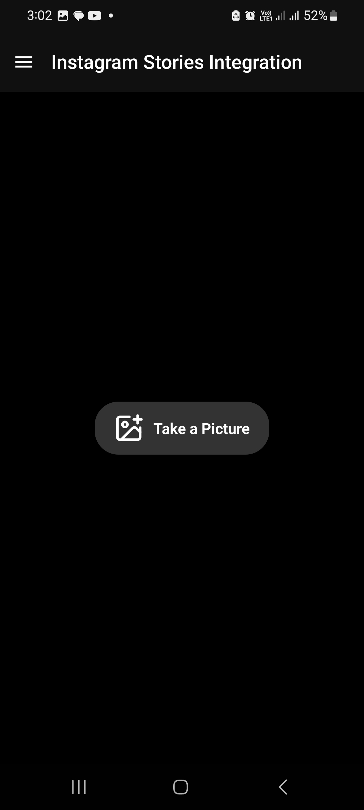

<!-- # Welcome to your Expo app 👋

This is an [Expo](https://expo.dev) project created with [`create-expo-app`](https://www.npmjs.com/package/create-expo-app).

## Get started

1. Install dependencies

   ```bash
   npm install
   ```

2. Start the app

   ```bash
    npx expo start
   ```

In the output, you'll find options to open the app in a

- [development build](https://docs.expo.dev/develop/development-builds/introduction/)
- [Android emulator](https://docs.expo.dev/workflow/android-studio-emulator/)
- [iOS simulator](https://docs.expo.dev/workflow/ios-simulator/)
- [Expo Go](https://expo.dev/go), a limited sandbox for trying out app development with Expo

You can start developing by editing the files inside the **app** directory. This project uses [file-based routing](https://docs.expo.dev/router/introduction).

## Get a fresh project

When you're ready, run:

```bash
npm run reset-project
```

This command will move the starter code to the **app-example** directory and create a blank **app** directory where you can start developing.

## Learn more

To learn more about developing your project with Expo, look at the following resources:

- [Expo documentation](https://docs.expo.dev/): Learn fundamentals, or go into advanced topics with our [guides](https://docs.expo.dev/guides).
- [Learn Expo tutorial](https://docs.expo.dev/tutorial/introduction/): Follow a step-by-step tutorial where you'll create a project that runs on Android, iOS, and the web.

## Join the community

Join our community of developers creating universal apps.

- [Expo on GitHub](https://github.com/expo/expo): View our open source platform and contribute.
- [Discord community](https://chat.expo.dev): Chat with Expo users and ask questions. -->

# Snapify

A photo editing & sharing app built in React Native + Expo, featuring an interactive canvas and seamless Instagram stories integration.

## Interactive Photo Canvas

<div style="display: flex;">
  <kbd></kbd>
   &nbsp;&nbsp;&nbsp;&nbsp;&nbsp;&nbsp;&nbsp;&nbsp;&nbsp;
  <kbd></kbd>
</div>

## ✨ Features

- **Capture Photos with Camera**: Launch the built-in camera interface to take photos directly within the app.
- **Interactive Drawing Canvas**: Load the captured photo onto a canvas and draw freely on the captured image.
- **Sticker Library Integration**: Add stickers to your image from a curated sticker library from the [Free Sticker Pack / Illustrations by Devin Choa](<https://www.figma.com/design/GwwOt0Yo0Hlxiy3qaUB6vW/Free-Sticker-Pack-%2F-Illustrations---Devin-Choa-(Community)?node-id=0-1&t=5LFki6FpgGlG4lHf-1>).
- **Drag and resize stickers**: You can drag the stickers anywhere on the image and resize them using pinch-to-zoom gesture.
- **Undo & Redo chnages**: Revert or re-apply drawing strokes, sticker movements and other changes to fine-tune your edits.
- **Export or Discard Edits**: Save your final edited photo to your device or discard it.

---

## Instagram Stories Integration

<div style="display: flex; justify-content: space-between; align-items:flex-start; gap: 55px">
  <kbd></kbd>
   &nbsp;&nbsp;&nbsp;&nbsp;&nbsp;&nbsp;&nbsp;&nbsp;&nbsp;
  <kbd></kbd>
</div>

## ✨ Features

- **Capture Photos with Camera**: Launch the built-in camera interface to take photos directly within the app.
- **Add Captions**: You can enter a caption after clicking the photo.
- **Drag & Style Captions**: Move your caption anywhere on the photo by dragging it, adjust its size and pick from a range of colors to match your vibe.
- **Direct Instagram Stories Sharing**: Provides a seamless transition from the app to Instagram with your photo preloaded, bypassing the system's native share modal.
- **Optimized Deep Linking & Intents**: Uses Instagram’s URL scheme (for ios) and Android intents to ensure your content loads straight into the Instagram Stories editor.
